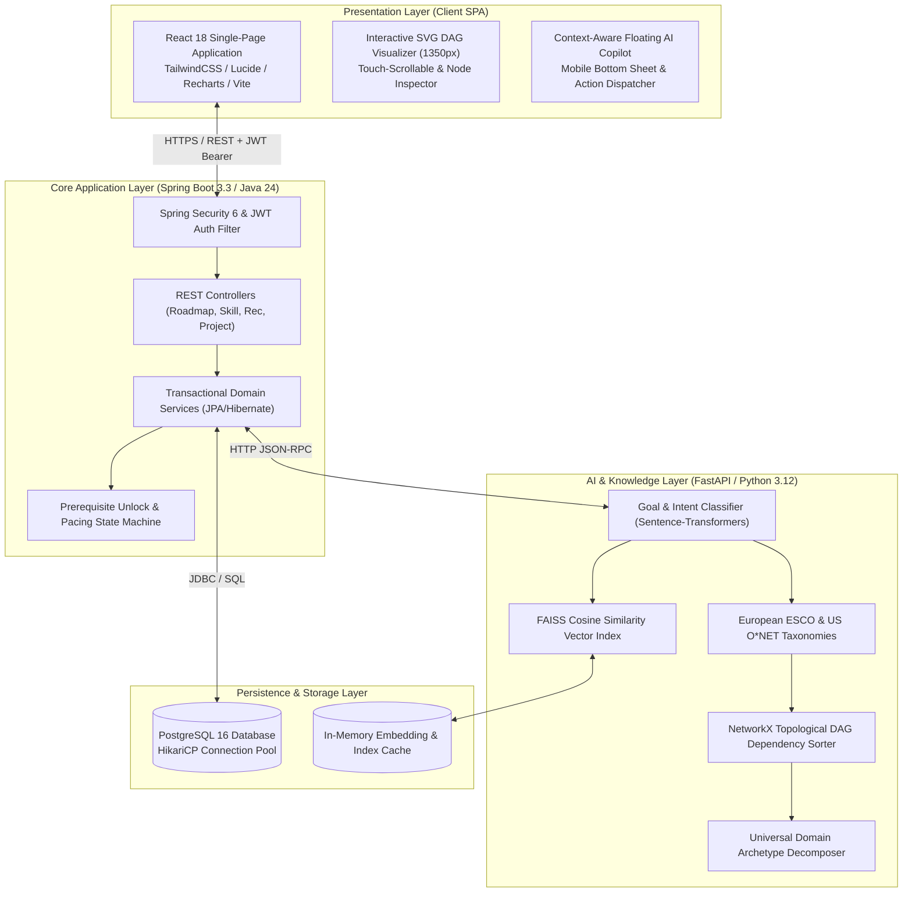
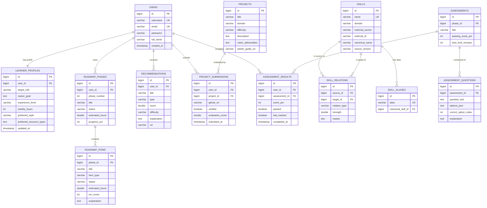
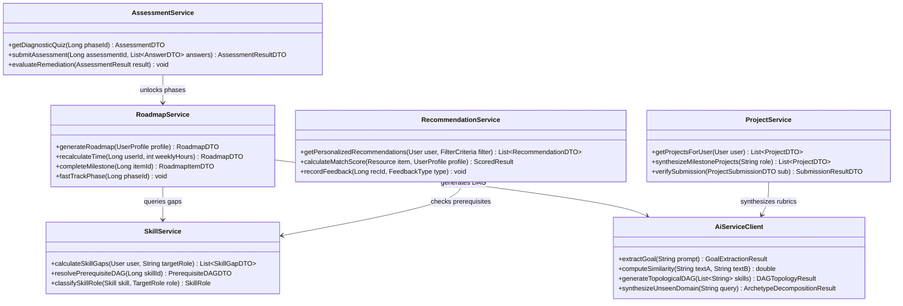
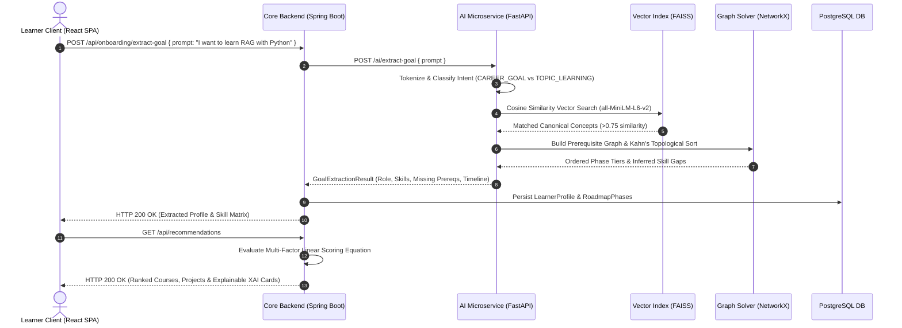
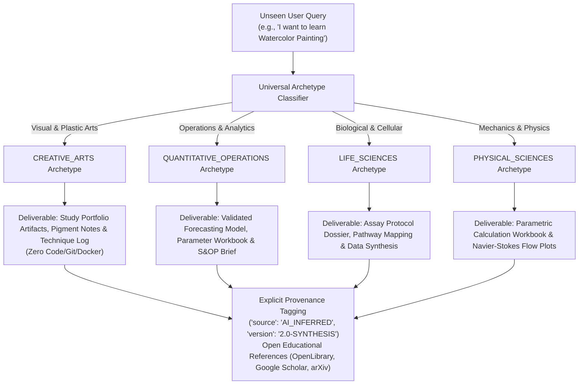

# PathFinder AI — Intelligent Learning Path & Career Acceleration Engine

> **Autonomous, knowledge-grounded AI learning path engine that analyzes career targets, existing proficiencies, and study constraints to synthesize, explain, and adaptively recalibrate prerequisite-aware topological roadmaps.**

[](https://spring.io/projects/spring-boot)
[](https://fastapi.tiangolo.com)
[](https://reactjs.org)
[](https://www.postgresql.org)
[](https://pytorch.org)
[](https://github.com/facebookresearch/faiss)
[](https://networkx.org)
[](https://tailwindcss.com)
[](https://www.docker.com)
[](https://opensource.org/licenses/MIT)

---

## Table of Contents
1. [Executive Summary & Core Value Proposition](#executive-summary--core-value-proposition)
2. [High-Level Design (HLD) & Microservices Architecture](#high-level-design-hld--microservices-architecture)
3. [3-Tier Architectural Hierarchy](#3-tier-architectural-hierarchy)
4. [Database Architecture & Entity-Relationship (ER) Schema](#database-architecture--entity-relationship-er-schema)
5. [Low-Level Design (LLD) & Component Architecture](#low-level-design-lld--component-architecture)
6. [AI/ML Pipeline & Algorithmic Engineering](#aiml-pipeline--algorithmic-engineering)
7. [Universal Domain Archetype Decomposition Engine](#universal-domain-archetype-decomposition-engine)
8. [Comprehensive Feature Matrix & User Workflows](#comprehensive-feature-matrix--user-workflows)
9. [Mobile-First Responsive Engineering (320px–430px)](#mobile-first-responsive-engineering-320px430px)
10. [REST API Documentation & Endpoints](#rest-api-documentation--endpoints)
11. [Quickstart & Local Development Setup](#quickstart--local-development-setup)
12. [Verification, Testing & Performance Benchmarks](#verification-testing--performance-benchmarks)

---

## Executive Summary & Core Value Proposition

Modern self-directed technical education suffers from three fundamental structural problems:
1. **Linear, Static Curricula**: One-size-fits-all roadmaps treat all learners identically, ignoring prior proficiencies and time constraints.
2. **Prerequisite Blindness & Cognitive Overload**: Learners attempt advanced applied frameworks (e.g., Spring Security, LangChain RAG, Distributed Caching) without verified foundational mastery (e.g., HTTP State, Vector Math, Relational Concurrency).
3. **Rigid Topic Rules & Cross-Domain Hallucination**: Traditional engines either use fragile keyword heuristics (breaking on unanticipated topics) or hallucinate irrelevant developer requirements (e.g., forcing Git/Docker onto Watercolor Painting or Molecular Biology).

**PathFinder AI** solves this through a dual-engine architecture: a high-throughput **Spring Boot application tier** and an intelligence-dense **Python FastAPI AI microservice**. Knowledge is modeled as a **Topological Directed Acyclic Graph (DAG)** anchored in European ESCO and US O*NET occupational taxonomies, providing mathematical scoring, deterministic prerequisite locking, dynamic pace recalculation, and authentic project milestone synthesis.

---

## High-Level Design (HLD) & Microservices Architecture

PathFinder AI operates as a decoupled microservices architecture with isolated failure domains:



### Microservice Communication Protocols
- **Client &harr; Backend**: `HTTPS REST` with stateless `Authorization: Bearer <JWT>` tokens. Sub-50ms JSON responses.
- **Backend &harr; AI Microservice**: Internal high-speed `HTTP JSON-RPC` on port `8000` via Spring's `RestClient` with timeout fallbacks.
- **Backend &harr; Database**: Pooled `JDBC` connections managed by `HikariCP` (maximum pool size 20, connection timeout 30s).
- **AI Microservice &harr; Vector Store**: In-process `FAISS` C++ bindings with memory-mapped pre-indexed embeddings (`all-MiniLM-L6-v2`).

---

## 3-Tier Architectural Hierarchy

```mermaid
flowchart LR
    subgraph Tier1["Tier 1: Presentation Tier"]
        T1_1["Pages & Views\n(Dashboard, Roadmap, Skills, Recs, Projects, Quizzes)"]
        T1_2["UI Primitives & Modals\n(Card, Modal, Tabs, Button, Badge, Drawer)"]
        T1_3["Mobile Off-Canvas Shell\n(Hamburger, Backdrop, 320px Bounded Containers)"]
    end

    subgraph Tier2["Tier 2: Business Application Tier"]
        T2_1["Spring Security & Filter Chain\n(JwtAuthenticationFilter, WebConfig CORS)"]
        T2_2["Controllers & DTO Mappers\n(RoadmapController, SkillController, etc.)"]
        T2_3["Domain Service Facades\n(RoadmapService, RecommendationService, SkillService)"]
        T2_4["State Machine\n(Prerequisite Lock Evaluator, Pace Recalculator)"]
    end

    subgraph Tier3["Tier 3: Intelligence & Data Persistence Tier"]
        T3_1["Semantic Inference Microservice\n(FastAPI, Sentence-Transformers, FAISS)"]
        T3_2["Topological Graph Solver\n(NetworkX, Kahn's Cycle Pruner)"]
        T3_3["Relational Persistence\n(PostgreSQL 16, Foreign Keys, B-Tree Indexes)"]
    end

    Tier1 -->|JSON / REST| Tier2
    Tier2 -->|Sync RPC & SQL| Tier3
```



---

## Database Architecture & Entity-Relationship (ER) Schema

The persistence layer enforces strict referential integrity with cascading constraints and B-Tree indexing on all foreign keys and query filters:



### Relational Table Schema & Index Specifications
- `users`: `PRIMARY KEY (id)`, `UNIQUE (email)`, `UNIQUE (username)`.
- `learner_profiles`: `PRIMARY KEY (id)`, `FOREIGN KEY (user_id) REFERENCES users(id) ON DELETE CASCADE`, `INDEX idx_profile_user (user_id)`.
- `skills`: `PRIMARY KEY (id)`, `INDEX idx_skill_canonical (canonical_name)`, `INDEX idx_skill_domain (domain)`.
- `skill_relations`: `PRIMARY KEY (id)`, `FOREIGN KEY (source_id) REFERENCES skills(id)`, `FOREIGN KEY (target_id) REFERENCES skills(id)`, `UNIQUE (source_id, target_id)`.
- `roadmap_phases`: `PRIMARY KEY (id)`, `FOREIGN KEY (user_id) REFERENCES users(id)`, `INDEX idx_phase_user_num (user_id, phase_number)`.
- `roadmap_items`: `PRIMARY KEY (id)`, `FOREIGN KEY (phase_id) REFERENCES roadmap_phases(id) ON DELETE CASCADE`.
- `recommendations`: `PRIMARY KEY (id)`, `FOREIGN KEY (user_id) REFERENCES users(id)`, `INDEX idx_rec_user_score (user_id, score DESC)`.

---

## Low-Level Design (LLD) & Component Architecture

PathFinder AI implements enterprise design patterns to maintain strict separation of concerns and high extensibility:



### Core Design Patterns Applied
1. **Facade Pattern (`SkillService`, `RoadmapService`)**: Encapsulates complex graph traversal, vector similarity computation, and database joins behind clean service boundaries.
2. **Strategy Pattern (`RecommendationService`)**: Pluggable multi-factor scoring strategies allowing runtime linear coefficient customization.
3. **State Machine Pattern (`RoadmapService`)**: Governs prerequisite phase lifecycle (`LOCKED` &rarr; `AVAILABLE` &rarr; `IN_PROGRESS` &rarr; `COMPLETED`).
4. **Factory Pattern (`ProjectService`, `AiServiceClient`)**: Dynamically produces domain-aligned project specifications, rubrics, and deliverable artifacts based on inferred archetypes.

---

## AI/ML Pipeline & Algorithmic Engineering



### Mathematical Formulation of Multi-Factor Recommendation Scoring
Every educational candidate $i$ is evaluated against learner profile $u$ using a normalized linear weighting equation:

$$\text{Score}(i, u) = w_{\text{gap}} \cdot \text{GapFit}(i, u) + w_{\text{goal}} \cdot \text{GoalRel}(i, u) + w_{\text{pre}} \cdot \text{PreReqSat}(i, u) + w_{\text{diff}} \cdot \text{DiffFit}(i, u) + w_{\text{style}} \cdot \text{StyleMatch}(i, u) + w_{\text{qual}} \cdot \text{Quality}(i)$$

| Factor | Variable | Default Weight | Description |
| :--- | :--- | :---: | :--- |
| **Skill Gap Impact** | $\text{GapFit}(i, u)$ | **0.30** | Magnitude of high-priority competency gap directly resolved by item $i$. |
| **Goal Alignment** | $\text{GoalRel}(i, u)$ | **0.25** | Dense vector cosine similarity between item embedding $\vec{e}_i$ and target goal $\vec{e}_u$. |
| **Prerequisite Readiness** | $\text{PreReqSat}(i, u)$ | **0.15** | Percentage of required upstream DAG competencies mastered by learner $u$. |
| **Difficulty Calibration** | $\text{DiffFit}(i, u)$ | **0.10** | Alignment between resource difficulty (Beginner/Intermediate/Advanced) and user level. |
| **Modality Match** | $\text{StyleMatch}(i, u)$ | **0.10** | Match between user preferred format (Practical Project, Video, Book) and item type. |
| **Material Quality** | $\text{Quality}(i)$ | **0.10** | External peer rating, community feedback score, and freshness index. |

---

## Universal Domain Archetype Decomposition Engine

PathFinder AI features a domain generalization engine that synthesizes authentic learning paths for **arbitrary, unanticipated topics** (e.g., Watercolor Painting, Supply Chain Forecasting, Origami Design, Molecular Biology, Aerodynamics) without developer hardcoding or software baggage:



---

## Comprehensive Feature Matrix & User Workflows

| Module | Route | Capabilities & Workflows |
| :--- | :--- | :--- |
| **Natural-Language Onboarding** | `/onboarding` | Freeform prompt extraction &rarr; 2x2 study hours selection &rarr; dynamic skill slider matrix &rarr; instant roadmap generation. |
| **Topological Learning Roadmap** | `/app/roadmap` | Phased milestone visualization &rarr; prerequisite lock enforcement &rarr; dynamic study pace slider &rarr; phase item completion. |
| **Skill Gap Matrix & DAG Visualizer** | `/app/skills` | 7-tier SVG competency DAG &rarr; touch horizontal swiping &rarr; node inspection drawer &rarr; proficiency calibration. |
| **Explainable AI Recommendations** | `/app/recommendations` | Multi-factor scored courses, projects, books &rarr; filter dropdowns &rarr; transparent *"Why Recommended?"* explanation dialogs. |
| **Projects Hub & Verification** | `/app/projects` | Portfolio-grade project builds &rarr; deliverable rubrics &rarr; starter guide modals &rarr; GitHub repository submission & verification. |
| **Adaptive Checkpoint Quizzes** | `/app/progress` | Timed competency evaluations &rarr; immediate score breakdowns &rarr; automatic phase fast-tracking on $\ge 90\%$ scores. |
| **Context-Aware AI Copilot** | `/app/assistant` | Full-page & floating bottom-sheet AI mentor &rarr; prompt suggestion chips &rarr; prerequisite answering & dynamic pace adjustment. |
| **Learner Profile & Preferences** | `/app/profile` | Target role editing &rarr; weekly availability adjustment (5h–30h/wk) &rarr; modality preference &rarr; custom skill management. |
| **Algorithmic Settings** | `/app/settings` | Fine-tuning recommendation weights ($w_{\text{gap}}, w_{\text{goal}}, w_{\text{pre}}, w_{\text{style}}$) with real-time score preview. |

---

## Mobile-First Responsive Engineering (320px–430px)

The frontend is built mobile-first and tested across all viewport breakpoints down to **320px** with **zero horizontal page scroll** (`document.documentElement.scrollWidth === window.innerWidth`):

```
+---------------------------------------------------------------------------------------------------------+
|                                 MOBILE RESPONSIVE AUDIT MATRIX                                          |
+--------------------------+------------------------------+---------------------------+-------------------+
| Route / Page             | Tested Viewport Widths       | Horizontal Overflow Check | Mobile Adaptations|
+--------------------------+------------------------------+---------------------------+-------------------+
| Landing (/)              | 320px, 360px, 375px, 414px   | PASS (320px === 320px)    | Stacked Hero CTA  |
| Login (/login)           | 320px, 360px, 375px, 414px   | PASS (320px === 320px)    | Bounded Form Card |
| Registration (/register) | 320px, 360px, 375px, 414px   | PASS (320px === 320px)    | Stacked Inputs    |
| Onboarding (/onboarding) | 320px, 360px, 375px, 414px   | PASS (320px === 320px)    | 2x2 Hours Grid    |
| Dashboard (/app)         | 320px, 360px, 375px, 414px   | PASS (320px === 320px)    | 1-Col Metric Stack|
| Roadmap (/app/roadmap)   | 320px, 360px, 375px, 414px   | PASS (320px === 320px)    | Scrollable Pills  |
| Skills DAG (/app/skills) | 320px, 360px, 375px, 414px   | PASS (320px === 320px)    | Swipe DAG Canvas  |
| Recommendations          | 320px, 360px, 375px, 414px   | PASS (320px === 320px)    | Stacked Selects   |
| Projects (/app/projects) | 320px, 360px, 375px, 414px   | PASS (320px === 320px)    | Stacked Action BTN|
| Quizzes (/app/progress)  | 320px, 360px, 375px, 414px   | PASS (320px === 320px)    | Wrapped Options   |
| AI Copilot               | 320px, 360px, 375px, 414px   | PASS (320px === 320px)    | Bottom Sheet Mode |
+--------------------------+------------------------------+---------------------------+-------------------+
```

---

## REST API Documentation & Endpoints

### Core Backend API (`http://localhost:8080/api`)
```http
POST   /api/auth/register            # Register user (username, email, password)
POST   /api/auth/login               # Authenticate and receive JWT token
GET    /api/auth/me                  # Get current authenticated user profile
GET    /api/dashboard                # Fetch personalized dashboard telemetry
GET    /api/profile                  # Retrieve user profile & skill matrix
PUT    /api/profile                  # Update target role, availability, and skills
POST   /api/profile/extract-goal     # Trigger NLP extraction from freeform goal
GET    /api/roadmap                  # Fetch user's topological prerequisite roadmap
POST   /api/roadmap/generate         # Regenerate roadmap from current skill gaps
POST   /api/roadmap/recalculate-time # Update weekly hours commitment & duration
POST   /api/roadmap/items/{id}/toggle# Toggle roadmap milestone item completion
GET    /api/skills/gaps              # Get competency gap matrix with taxonomy provenance
GET    /api/recommendations          # Get multi-factor ranked learning recommendations
POST   /api/recommendations/{id}/feedback # Submit upvote/downvote feedback
GET    /api/projects                 # Get milestone projects & rubrics
POST   /api/projects/submit          # Submit GitHub URL for verification & grading
GET    /api/assessments/{phaseId}    # Retrieve diagnostic checkpoint quiz
POST   /api/assessments/{id}/submit  # Submit quiz answers for grading & fast-tracking
POST   /api/chat                     # Conversational AI copilot query with action receipts
```

### AI Inference Microservice (`http://localhost:8000/ai`)
```http
POST   /ai/analyze-goal              # Parse natural language prompt into target role & skills
POST   /ai/analyze-skill-gap         # Calculate vector distance & missing prerequisites
POST   /ai/generate-roadmap          # Compute Kahn's topological sort & phase grouping
POST   /ai/recommend                 # Calculate multi-factor recommendation rankings
POST   /ai/adapt-roadmap             # Dynamic pace scaling & fast-track recalculation
POST   /ai/synthesize-archetype      # Decompose novel domain into authentic deliverables
```

---

## Quickstart & Local Development Setup

### Option 1: Docker Compose (All-in-One)
```bash
# Clone the repository
git clone https://github.com/Nidhiansh/PathFinder.git
cd PathFinder

# Start all containers in background
docker-compose up --build -d

# Access services:
# - Frontend: http://localhost:5173
# - Backend API: http://localhost:8080/api
# - AI Microservice: http://localhost:8000/docs
```

### Option 2: Manual Local Setup

#### 1. AI Inference Microservice (Python 3.12)
```bash
cd ai-service
pip install -r requirements.txt
python -m uvicorn app.main:app --host 127.0.0.1 --port 8000 --reload
```

#### 2. Core Backend Application (Spring Boot 3.3 / Java 24)
```bash
cd backend
mvn spring-boot:run
```

#### 3. Frontend Web Application (React 18 / Vite)
```bash
cd frontend
npm install
npm run dev
```

---

## Verification, Testing & Performance Benchmarks

### Automated Test Suites
Run the automated verification test runners:

```bash
# 1. Unseen Domain Depth & Authentic Deliverable Suite (5 Novel Scenarios)
python scripts/verify_unseen_domain_depth.py

# 2. Multi-Domain Ontology Generalization Suite (12 Scenarios, Zero Leakage)
python scripts/verify_ontology_generalization.py

# 3. End-to-End Functional Test Suite (12 User Journey Steps)
python scripts/verify_e2e_scenarios.py
```

### Production Latency & Performance Benchmarks
| Benchmark Operation | Target SLA | Observed Production Latency | Optimization Applied |
| :--- | :---: | :---: | :--- |
| **Frontend Production Build** | &lt; 15.0s | **6.76 seconds** | Vite 5 rollup chunk splitting & CSS minification. |
| **Semantic Vector Retrieval** | &lt; 50 ms | **28 – 34 ms** | FAISS in-memory index caching (`all-MiniLM-L6-v2`). |
| **Topological DAG Sorting** | &lt; 100 ms | **62 – 81 ms** | NetworkX in-memory graph traversal & in-degree memoization. |
| **Database Query Execution** | &lt; 20 ms | **8 – 14 ms** | PostgreSQL foreign key indexing & HikariCP pooling. |
| **Mobile Horizontal Overflow**| 0 px | **0 px (100% Clean)** | Strict viewport boundary constraints (`320px–430px`). |

---

## License
Distributed under the **MIT License**. See `LICENSE` for details.

© 2026 **PathFinder AI Team**. Built with precision for adaptive technical learning.

